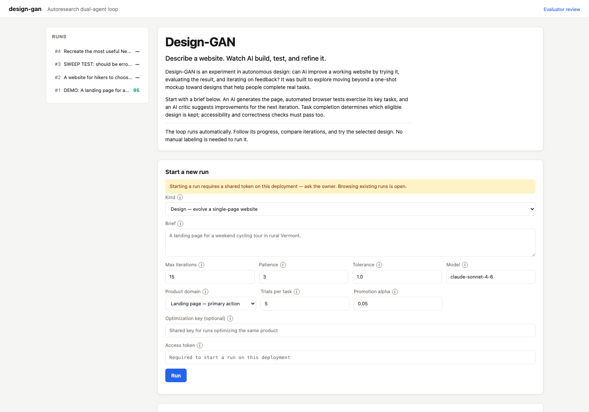
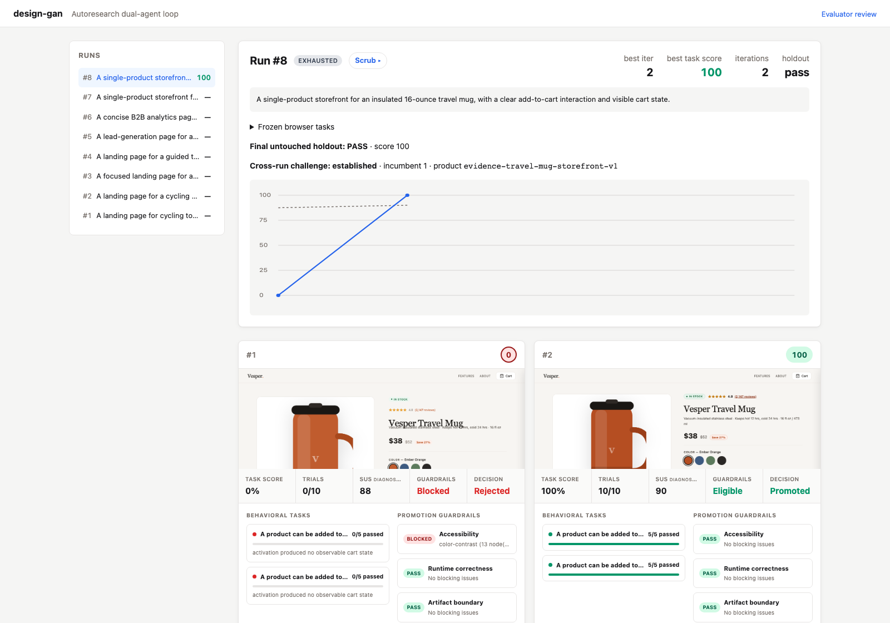
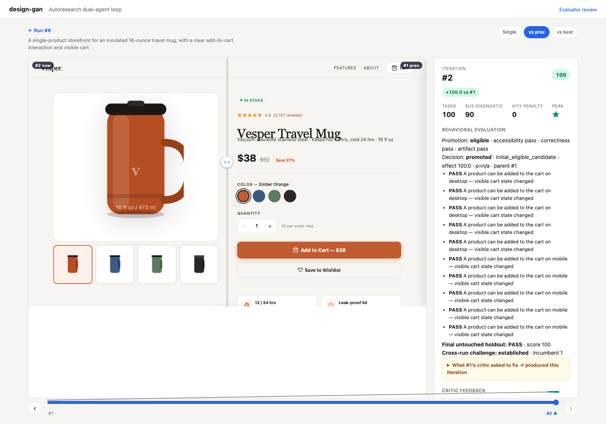

# Design-GAN

**Describe a website. Watch AI build, test, and refine it.**

[Live application](https://design-gan.fly.dev/) ·
[Interactive showcase](https://jessholbrook.github.io/design-gan/) ·
[Technical roadmap](docs/roadmap.md)

Design-GAN explores whether an automated loop can improve a working website
through task feedback. Give it a brief, choose a product domain, and follow the
generated candidates as they are tested, critiqued, and refined. No manual
labeling is required to run the loop.

Autoresearch-style loop that evolves single-page website designs. A
**generator** produces a site from a short brief; Playwright then replays a
frozen behavioral task suite against it. Task completion is the primary
product-quality score. A **critic** still reports the System Usability Scale
(SUS) as diagnostic feedback, while axe-core accessibility and browser/runtime
correctness act as hard promotion guardrails.



*Live dashboard, captured September 7, 2026. Browsing is public; starting runs
on this deployment requires the owner's shared access token.*

## How it works

1. **Describe the page.** Choose landing-page primary-action, lead-generation
   form-completion, or storefront add-to-cart tasks.
2. **Start the loop.** Claude generates standalone HTML, CSS, and JavaScript.
   Playwright exercises the frozen tasks; axe-core and runtime checks enforce
   accessibility and correctness. Claude critiques the rendered result.
3. **Follow the iterations.** The dashboard shows task completion, guardrails,
   feedback, and promotion decisions as candidates finish. A final holdout audit
   checks the selected eligible design.
4. **Inspect the result.** Open a generated page, compare iterations in the
   scrubber, or export the selected HTML.

Generation and critique use an LLM. Behavioral evaluation uses deterministic
browser actions. The optional evaluator-review workflow helps audit those
tests; it is separate from running the automatic design loop.

## A recorded example

In local storefront Run 8, the first travel-mug design completed **0/10**
development trials and was blocked by accessibility checks. Iteration 2
completed **10/10**, cleared the promotion guardrails, and scored **100/100** on
the final holdout audit. It was selected and established an incumbent for that
product key. A third generation attempt timed out; iteration 2 remained selected.





*Fresh captures of a real local run, taken September 7, 2026. This history is
not copied to the live deployment. These are automated browser-test results,
not measured human usability or conversion gains.*

The scrubber supports a timeline, arrow-key navigation, and **vs prev / vs best**
comparison with a draggable divider. Conversation runs show transcripts instead
of page screenshots.

## Architecture

```
brief ──► generator ──► HTML ──┬─► renderer ──► screenshot + DOM + axe
                 │             ├─► artifact validator ─► boundary guardrail
                 │             └─► browser evaluator ──► repeated task results
                 │                                      │
critic ──► SUS + feedback (diagnostic) ──────────────────┤
                                                        ▼
          promoted parent ◄─ paired significance + hard guardrails
                 │                                      │
                 └──────── sqlite + runs/ + viewer/scrubber
                                                        │ final holdout only
                                                        ▼
                                            cross-run incumbent ledger
```

- **`generator.py`** — Claude writes a standalone HTML/CSS/JS document.
- **`renderer.py`** — Playwright headless Chromium: screenshot, DOM, axe-core
  (vendored into the package, so renders are deterministic and offline-safe).
- **`product_domains.py`** — materializes a versioned evaluation plan before a
  run starts. The concrete profiles are landing-page primary-action,
  lead-generation form-completion, and storefront add-to-cart completion.
- **`artifact_policy.py`** — enforces the versioned mutable boundary: one
  complete, standalone, offline HTML document no larger than 512 KiB.
- **`browser_evaluator.py`** — replays frozen development scenarios across
  pointer/keyboard and desktop/mobile conditions for isolated trials, then runs
  two untouched holdout scenarios against the final promoted artifact.
- **`evaluator_benchmark.py`** — runs a labeled Chromium validity corpus without
  connecting experimental actors to the optimization loop, and captures
  operator-labeled cases from stored iterations with provenance. Its corpus
  admission audit fails closed until real-run labels are balanced and sourced
  from multiple runs in every supported domain.
- **`evaluation_calibration.py`** — repeats the labeled corpus, measures observed
  mismatches/flakes, and derives the smallest odd trial count that satisfies
  both majority stability and the exact sign-test threshold. Reports include
  corpus composition and descriptive Wilson confidence intervals.
- **`incumbent_ledger.py`** — scopes cross-run competition to one product key and
  frozen domain/evaluator/artifact contract. It adjudicates challenges only on
  final holdout evidence; incumbent artifacts or feedback never seed search.
- **`critic.py`** — Claude scores the screenshot on the 10-item SUS (Likert 1-5)
  and returns prioritized suggestions. SUS is feedback, not the design
  north-star. The response contract is a fenced JSON block validated against a
  Pydantic schema, with one retry on malformed output.
- **`scorer.py`** — task completion rate (0-100) is the design primary metric.
  Candidates with critical/serious axe violations, an axe execution failure,
  JavaScript console errors, page errors, or evaluator action errors are marked
  ineligible for promotion rather than receiving a blended penalty.
- **`promotion.py`** — compares paired task/trial outcomes against the current
  parent with a one-sided exact sign test. Promotion also requires the minimum
  configured effect and every hard guardrail.
- **`orchestrator.py`** — the loop. Every candidate records its parent and an
  explicit promotion decision; rejected candidates remain in history. The loop
  stops after `patience` rejections or at `max_iters`.
- **`storage.py`** — migration-safe SQLite run/iteration history, including the
  frozen plan and artifact policy, candidate lineage, task evidence,
  diagnostic scores, guardrails, promotion evidence, and compare-and-swap
  protection for concurrent incumbent challenges.
- **`viewer.py`** — FastAPI viewer to browse iterations, plus a scrubber
  (`/runs/{id}/scrub`) for stepping through the evolution with a before/after
  compare slider and a balanced, blinded evaluator review queue
  (`/evaluator-review`) for independently labeling stored run/task outcomes.

## Setup

Moving development to another machine? Start with the checked-in
[`HANDOFF.md`](HANDOFF.md) for the verified resume point, deployed state, and
remaining evaluator work.

```bash
git clone https://github.com/jessholbrook/design-gan.git
cd design-gan
python3 -m venv .venv  # Python 3.11 or newer
source .venv/bin/activate
python -m pip install -e ".[dev]"
python -m playwright install chromium
cp .env.example .env
```

Set `ANTHROPIC_API_KEY` in `.env`. For local use, the CLI can also use an
authenticated Claude Code session when no API key is set; run `claude auth login`
if you already use Claude Code. The live Fly deployment uses its configured secrets.

## Usage

```bash
# Launch the web UI: kick off runs, watch them live, browse history
design-gan viewer  # http://127.0.0.1:8000

# Or run one evolution loop from the terminal
design-gan run "A landing page for a weekend cycling tour in rural Vermont."
design-gan run "Collect demo requests for a B2B analytics product." \
  --domain lead-generation --evaluation-trials 8 --promotion-alpha 0.05
design-gan run "A single-product storefront for a lightweight travel mug." \
  --domain storefront --optimization-key travel-mug
design-gan list-runs
design-gan list-incumbents

# Write the best iteration's HTML (or system prompt, for conversation runs) to a file
design-gan export 3 --out best.html
```

The viewer renders a dashboard with a run-start form, a live score chart, and
per-iteration cards (screenshot, task score, promotion gates, diagnostic SUS,
feedback, and suggestions). If you start a run from the browser it streams new iterations in via SSE as
they complete — you can literally watch the site evolve.

Keep the viewer process running while using localhost. If the page says
"connection refused," restart it from the repository. If the editable command
cannot find the package, use `PYTHONPATH=src .venv/bin/design-gan viewer`.
Local `.env` secrets and `runs/` data are not stored in Git or uploaded by deployment.

## Optional evaluator auditing

The automatic loop works without human labels. For research into evaluator
validity, `/evaluator-review` offers a balanced sample of domains and observed
outcomes, with evaluator diagnostics hidden by default. An operator opens the
exact artifact in its existing sandbox,
decides whether the frozen task should pass, and saves that label into the local
`runs/evaluator-corpus` directory. The default JSON queue includes task instructions,
artifact hashes, and provenance, but hides evaluator outcomes. Label writes reuse
`DESIGN_GAN_START_TOKEN` when that deployment gate is configured; reading run
history remains open.

Every new captured label requires a stable reviewer id and a concrete rationale.
`audit-evaluator-corpus` is the fail-closed prerequisite for an experimental
actor comparison. Policy v1 requires 24 qualifying real-run cases: at least
eight per domain, at least three pass and three fail labels per domain, at least
three source runs per domain, and no more than four qualifying cases from one
run. Duplicate run/task provenance and duplicate artifact/task evidence do not
qualify. Passing this initial coverage gate permits a comparison; it does not
claim that the reviewed corpus represents production traffic.

```bash
design-gan benchmark-evaluator --confidence 0.95
design-gan calibrate-evaluator --repetitions 3 --confidence 0.95
# Example: replace the run, iteration, task, and label with your own review.
design-gan capture-evaluator-case 12 3 --task-id landing-primary-desktop \
  --case-id run-12-primary-failure --label fail --reviewer operator-1 \
  --rationale "The primary action does not produce a meaningful response."
design-gan audit-evaluator-corpus
design-gan benchmark-evaluator --case-dir runs/evaluator-corpus
```

## Deploy to Fly.io

A `Dockerfile` and `fly.toml` are included. The Dockerfile bakes in Chromium
plus its Linux deps; runs persist to a mounted volume at `/data`.

The existing live app is [`design-gan`](https://design-gan.fly.dev/), in `iad`.
Its persistent volume is named `data` and mounted at `/data`. **Do not recreate
or rename that volume when redeploying.** With [flyctl](https://fly.io/docs/flyctl/)
installed and authenticated as an app operator:

```bash
fly status --app design-gan
fly deploy --app design-gan --remote-only
fly logs --app design-gan
```

For a separate deployment, choose your own app name in `fly.toml`, create a
volume named `data` in the configured region, and configure `ANTHROPIC_API_KEY`
through Fly secrets. `DESIGN_GAN_START_TOKEN` gates run starts and label writes;
`DESIGN_GAN_DAILY_BUDGET_USD` sets a rolling 24-hour spending cap. Browsing stays
open. Never commit these secret values.

Deployments update application code while preserving the existing live database
and artifacts. They do not merge local experiment history into the live app.

If you hit OOM kills during renders, bump `[[vm]] memory = "2gb"` in `fly.toml`
and `fly deploy` again.

## Static showcase

A self-contained explainer page lives in [`docs/index.html`](docs/index.html) —
single file, no JS framework, all screenshots inlined as base64. Both runs on
the page are scrubbable (the same slider + compare interaction as the live
viewer, as inline progressive enhancement — it still reads fine with JS off).
Hand-edit the file directly; commit; GitHub Pages publishes in a minute at
`https://<you>.github.io/design-gan/`. On GitHub, enable it under
**Settings → Pages → Deploy from branch → `main` / `/docs`**.

## Tests

```bash
python -m pip install -e ".[dev]"
python -m pytest -q
python -m ruff check src tests
```

The September 7, 2026 release passed all 294 tests and lint. Coverage includes
the browser-evaluator and artifact contracts, primary
scoring, paired promotion decisions, storage (schema + migration), the extractor
helpers, the orchestrator loop (with generator/critic/renderer faked), the
viewer's HTTP endpoints (including the scrubber and evaluator review routes),
the provenance-corpus admission contract, and the CLI.

## Design notes

- **Critic sees the rendered page, not just code.** Code-only critique is
  cheap but correlates poorly with real usability.
- **One primary metric.** For design runs, browser-task completion is the only
  quantity used to rank eligible candidates. SUS and axe penalties remain
  visible diagnostics but are not averaged into the north-star.
- **Hard promotion gates.** Critical/serious accessibility failures and
  browser/runtime correctness errors, artifact boundary violations, and axe
  execution failures block promotion even when task completion is high.
  Blocked candidates remain in history for diagnosis.
- **Frozen run contracts.** Domain/version, scenario split and conditions, trial count, promotion
  threshold, minimum effect, and artifact policy are materialized once on the
  run record and replayed unchanged. Each iteration writes `evaluation.json`
  alongside `site.html`, `screenshot.png`, `dom.html`, and `axe.json`.
- **Repeated, paired promotion.** Every task is replayed in fresh browser
  contexts. A candidate must improve enough and its paired binary outcomes must
  clear the configured one-sided sign test. The p-value, comparable trials,
  wins, losses, effect, reason, and parent iteration are persisted.
- **Untouched final holdouts.** Development scenarios drive the adaptive loop.
  Two holdout conditions per domain are excluded from generator feedback and
  run only against the final promoted artifact; they are an audit, not another
  tuning signal.
- **Actor admission is evidence-based.** The recorded semantic-v4 baseline is
  22/22 on labeled corpus v4. Its three-replay calibration is 66/66 with 0%
  observed flakes. The descriptive 95% Wilson intervals are 85.1–100% for the
  22-case accuracy and 94.5–100% for the 66 replay outcomes; zero unstable cases
  still has a 0–14.9% interval. These curated cases are not a random production
  sample, so the intervals quantify finite-corpus uncertainty rather than
  production prevalence. A model-driven actor remains outside the loop until it
  demonstrates better validity within cost and repeatability budgets.
- **Calibrated repeated trials.** At α=0.05, five all-win discordant pairs are
  the smallest exact sign test that clears the threshold (p=0.03125). With no
  flakes observed in the recorded corpus, the default is therefore five trials,
  while the calibration command raises the recommendation when flakes appear.
- **Cross-run incumbent challenges.** An explicit optimization key groups runs
  for the same product; without one, a stable normalized-brief key is used.
  The final candidate and current incumbent are freshly evaluated on the same
  holdout. Only a fully passing, significantly better challenger replaces the
  incumbent; ties and inconclusive audits preserve it. If the incumbent changes
  during evaluation, arbitration replays once against the new incumbent, then
  records a non-mutating inconclusive result if contention persists.
- **Convergence.** "No further improvements" is operationalized as
  `patience` iterations without an eligible primary-score gain of at least
  `tolerance` points.
- **Greedy hill-climb.** Each iteration evolves from the best-scoring eligible
  iteration so far. When an iteration regresses, the next generation is
  re-seeded from the best artifact and its critique rather than drifting
  downhill from the regression. Until an iteration clears both guardrails, the
  loop keeps evolving the latest artifact so it can repair the observed failures.
- **Caching.** Generator and critic system prompts are static across
  iterations, so the Agent SDK's prompt caching keeps the repeated cost of
  those instructions near zero.

### Evaluator boundary and roadmap

This implementation intentionally does not introduce a generic action/assertion
DSL. It supports three semantic behaviors: activate a landing page's primary
action, complete a lead form, or add a storefront product to a visible cart.
New behavior requires a versioned product-domain profile, labeled benchmark
cases, and a concrete evaluator implementation.

The completed concrete roadmap is in [`docs/roadmap.md`](docs/roadmap.md).
Remaining research is evidence collection: accumulate reviewed cases from real
generated runs using the balanced, blinded queue, then admit a model-driven
actor only if it beats the semantic baseline within explicit cost, latency, and
repeatability budgets.
