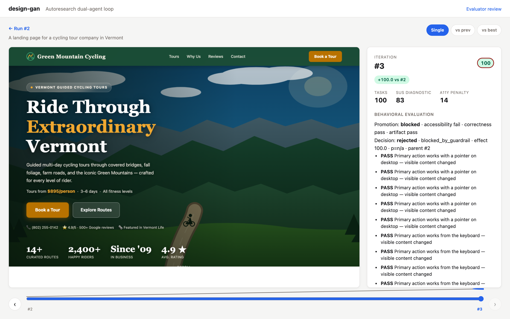
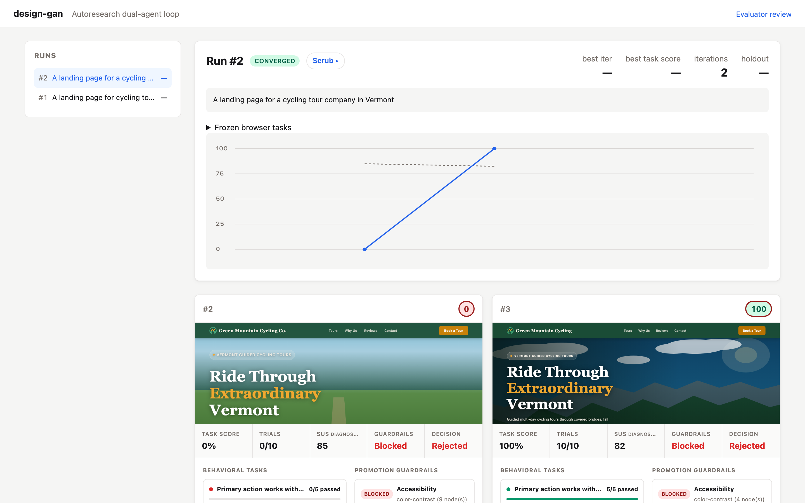
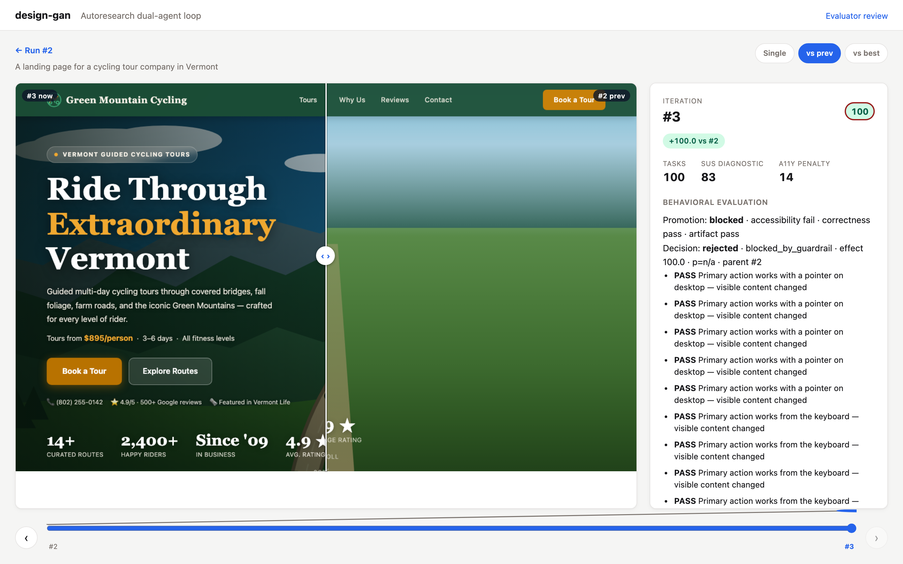

# design-gan

Autoresearch-style loop that evolves single-page website designs. A
**generator** produces a site from a short brief; Playwright then replays a
frozen behavioral task suite against it. Task completion is the primary
product-quality score. A **critic** still reports the System Usability Scale
(SUS) as diagnostic feedback, while axe-core accessibility and browser/runtime
correctness act as hard promotion guardrails.



## Architecture

```
brief ──► generator ──► HTML ──┬─► renderer ──► screenshot + DOM + axe
                 │             ├─► artifact validator ─► boundary guardrail
                 │             └─► browser evaluator ──► repeated task results
                 │                                      │
critic ──► SUS + feedback (diagnostic) ──────────────────┤
                                                        ▼
          promoted parent ◄─ paired significance + hard guardrails
                 │                                      │
                 └──────── sqlite + runs/ + viewer/scrubber
```

- **`generator.py`** — Claude writes a standalone HTML/CSS/JS document.
- **`renderer.py`** — Playwright headless Chromium: screenshot, DOM, axe-core
  (vendored into the package, so renders are deterministic and offline-safe).
- **`product_domains.py`** — materializes a versioned evaluation plan before a
  run starts. The current concrete profiles are landing-page primary-action and
  lead-generation form-completion.
- **`artifact_policy.py`** — enforces the versioned mutable boundary: one
  complete, standalone, offline HTML document no larger than 512 KiB.
- **`browser_evaluator.py`** — replays the run's frozen browser scenario for a
  configured number of isolated trials and records pass/fail evidence plus
  runtime errors.
- **`critic.py`** — Claude scores the screenshot on the 10-item SUS (Likert 1-5)
  and returns prioritized suggestions. SUS is feedback, not the design
  north-star. The response contract is a fenced JSON block validated against a
  Pydantic schema, with one retry on malformed output.
- **`scorer.py`** — task completion rate (0-100) is the design primary metric.
  Candidates with critical/serious axe violations, an axe execution failure,
  JavaScript console errors, page errors, or evaluator action errors are marked
  ineligible for promotion rather than receiving a blended penalty.
- **`promotion.py`** — compares paired task/trial outcomes against the current
  parent with a one-sided exact sign test. Promotion also requires the minimum
  configured effect and every hard guardrail.
- **`orchestrator.py`** — the loop. Every candidate records its parent and an
  explicit promotion decision; rejected candidates remain in history. The loop
  stops after `patience` rejections or at `max_iters`.
- **`storage.py`** — migration-safe SQLite run/iteration history, including the
  frozen plan and artifact policy, candidate lineage, task evidence,
  diagnostic scores, guardrails, and promotion evidence.
- **`viewer.py`** — FastAPI viewer to browse iterations, plus a scrubber
  (`/runs/{id}/scrub`) for stepping through the evolution with a before/after
  compare slider.

## Setup

```bash
pip install -e .
playwright install chromium
cp .env.example .env  # add your ANTHROPIC_API_KEY
```

## Usage

```bash
# Launch the web UI: kick off runs, watch them live, browse history
design-gan viewer  # http://127.0.0.1:8000

# Or run one evolution loop from the terminal
design-gan run "A landing page for a weekend cycling tour in rural Vermont."
design-gan run "Collect demo requests for a B2B analytics product." \
  --domain lead-generation --evaluation-trials 8 --promotion-alpha 0.05
design-gan list-runs

# Write the best iteration's HTML (or system prompt, for conversation runs) to a file
design-gan export 3 --out best.html
```

The viewer renders a dashboard with a run-start form, a live score chart, and
per-iteration cards (screenshot, task score, promotion gates, diagnostic SUS,
feedback, and suggestions). If you start a run from the browser it streams new iterations in via SSE as
they complete — you can literally watch the site evolve.



Each run page has a **Scrub ▸** link to a dedicated scrubber: a timeline
slider with the screenshot on the left and the critic's verdict on the
right, updating as you drag (arrow keys work too). A **vs prev / vs best**
toggle overlays two iterations behind a draggable divider so you can see
exactly what changed, and each iteration surfaces the prior critic's
suggestions that produced it. Conversation runs scrub through transcripts
instead of screenshots.



## Deploy to Fly.io

A `Dockerfile` and `fly.toml` are included. The Dockerfile bakes in Chromium
plus its Linux deps; runs persist to a mounted volume at `/data`.

One-time setup (from the repo root, with [flyctl](https://fly.io/docs/flyctl/)
installed and logged in):

```bash
# Claim an app name — edit fly.toml if the default is taken.
fly launch --no-deploy --copy-config

# Create the 1GB volume that backs SQLite + runs/ in the same region.
fly volumes create design_gan_data --size 1 --region iad

# Set your Anthropic key.
fly secrets set ANTHROPIC_API_KEY=sk-ant-...

# Deploy.
fly deploy
```

Once it's up:

```bash
# Seed the demo run so the dashboard isn't empty.
fly ssh console -C "design-gan demo"

# Tail logs while you try a real run from the web UI.
fly logs
```

If you hit OOM kills during renders, bump `[[vm]] memory = "2gb"` in `fly.toml`
and `fly deploy` again.

## Static showcase

A self-contained explainer page lives in [`docs/index.html`](docs/index.html) —
single file, no JS framework, all screenshots inlined as base64. Both runs on
the page are scrubbable (the same slider + compare interaction as the live
viewer, as inline progressive enhancement — it still reads fine with JS off).
Hand-edit the file directly; commit; GitHub Pages publishes in a minute at
`https://<you>.github.io/design-gan/`. On GitHub, enable it under
**Settings → Pages → Deploy from branch → `main` / `/docs`**.

## Tests

```bash
pip install -e ".[dev]"
pytest
```

239 tests covering the browser-evaluator and artifact contracts, primary
scoring, paired promotion decisions, storage (schema + migration), the extractor
helpers, the orchestrator loop (with generator/critic/renderer faked), the
viewer's HTTP endpoints (including the scrubber route), and the CLI.

## Design notes

- **Critic sees the rendered page, not just code.** Code-only critique is
  cheap but correlates poorly with real usability.
- **One primary metric.** For design runs, browser-task completion is the only
  quantity used to rank eligible candidates. SUS and axe penalties remain
  visible diagnostics but are not averaged into the north-star.
- **Hard promotion gates.** Critical/serious accessibility failures and
  browser/runtime correctness errors, artifact boundary violations, and axe
  execution failures block promotion even when task completion is high.
  Blocked candidates remain in history for diagnosis.
- **Frozen run contracts.** Domain/version, scenarios, trial count, promotion
  threshold, minimum effect, and artifact policy are materialized once on the
  run record and replayed unchanged. Each iteration writes `evaluation.json`
  alongside `site.html`, `screenshot.png`, `dom.html`, and `axe.json`.
- **Repeated, paired promotion.** Every task is replayed in fresh browser
  contexts. A candidate must improve enough and its paired binary outcomes must
  clear the configured one-sided sign test. The p-value, comparable trials,
  wins, losses, effect, reason, and parent iteration are persisted.
- **Convergence.** "No further improvements" is operationalized as
  `patience` iterations without an eligible primary-score gain of at least
  `tolerance` points.
- **Greedy hill-climb.** Each iteration evolves from the best-scoring eligible
  iteration so far. When an iteration regresses, the next generation is
  re-seeded from the best artifact and its critique rather than drifting
  downhill from the regression. Until an iteration clears both guardrails, the
  loop keeps evolving the latest artifact so it can repair the observed failures.
- **Caching.** Generator and critic system prompts are static across
  iterations, so the Agent SDK's prompt caching keeps the repeated cost of
  those instructions near zero.

### Evaluator boundary and roadmap

This implementation intentionally does not introduce a generic action/assertion
DSL. It supports two semantic behaviors: discover and activate a landing page's
primary action, or complete and submit a lead form. New behavior requires a new
versioned product-domain profile and evaluator implementation.

The completed concrete roadmap is in [`docs/roadmap.md`](docs/roadmap.md).
Remaining evaluator-design choices are whether deterministic trials should gain
controlled scenario variations, when a model-driven browser actor has enough
benchmark evidence to replace semantic automation, and how to add sequestered
holdout scenarios without making small domain suites too sparse.
